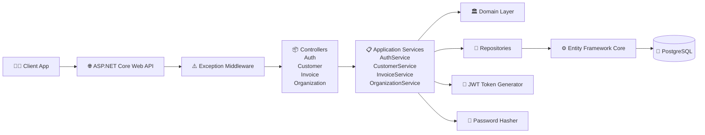

# InvoicePro - Invoice Management API

InvoicePro is a RESTful Invoice Management API built with ASP.NET Core, PostgreSQL, and Clean Architecture principles, featuring JWT authentication and customer, invoice, and organization management. It demonstrates modern .NET backend development practices including Repository Pattern, Dependency Injection, Entity Framework Core, and scalable layered architecture.

## Technical Highlights
- Clean Architecture principles
- ASP.NET Core Web API (.NET 9)
- JWT Authentication & Authorization
- Repository Pattern
- Service Layer Architecture
- Dependency Injection
- Entity Framework Core
- PostgreSQL Integration
- EF Core Entity Relationships
- Password Hashing & Security
- Global Exception Handling Middleware
- Standardized API Response Structure
- Swagger / OpenAPI Documentation
- RESTful API Design 