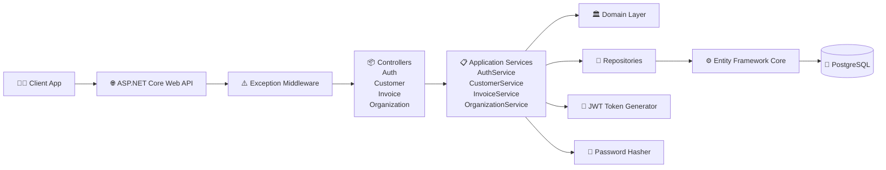

# InvoicePro - Invoice Management API

InvoicePro is a RESTful Invoice Management API built with ASP.NET Core, PostgreSQL, and Clean Architecture principles, featuring JWT authentication and customer, invoice, and organization management. It demonstrates modern .NET backend development practices including Repository Pattern, Dependency Injection, Entity Framework Core, and scalable layered architecture.



## Technical Highlights
- Clean Architecture principles
- ASP.NET Core Web API (.NET 9)
- JWT Authentication & Authorization
- Repository Pattern
- Service Layer Architecture
- Dependency Injection
- Entity Framework Core
- PostgreSQL Integration
- EF Core Entity Relationships
- Password Hashing & Security
- Global Exception Handling Middleware
- Standardized API Response Structure
- Swagger / OpenAPI Documentation
- RESTful API Design 


### Prerequisites
- [.NET 9 SDK](https://dotnet.microsoft.com/download)
- [Docker & Docker Compose](https://docs.docker.com/get-docker/)
- PostgreSQL 16 (or use the Dockerized version below)

### Environment Variables
This project uses environment variables to keep secrets out of source control.

1. Copy the example env file:
```bash
   cp .env.example .env
```
2. Fill in `.env` with your own values:
   | Variable      | Description                          |
   |---------------|---------------------------------------|
   | `DB_PASSWORD` | PostgreSQL password                   |
   | `JWT_SECRET`  | Secret key used to sign JWT tokens    |

### Running with Docker
This spins up both the API and a PostgreSQL container:
```bash
docker compose up --build
```
The API will be available at `http://localhost:5000`.

### Running Locally (without Docker)
1. Set up your local secrets:
```bash
   cd src/InvoicePro.API
   dotnet user-secrets init
   dotnet user-secrets set "Jwt:Key" "<your-secret>"
   dotnet user-secrets set "ConnectionStrings:DefaultConnection" "Host=localhost;Port=5432;Database=invoicepro_db;Username=postgres;Password=postgres"
```
2. Run the API:
```bash
   dotnet run --project src/InvoicePro.API
```